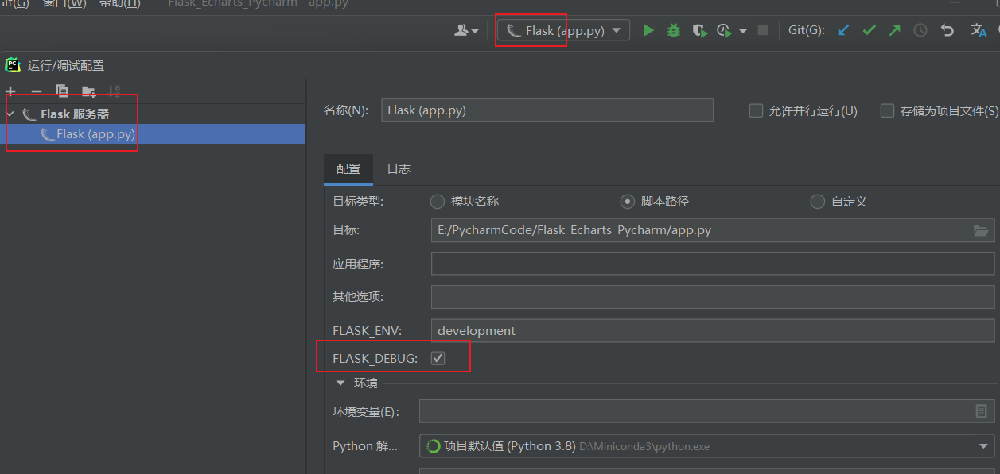
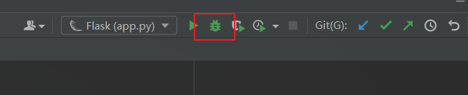
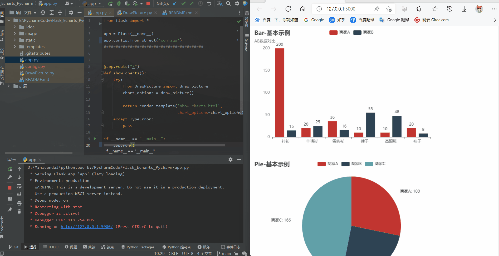

## Use flask to display the modifications and changes of the echarts table in pycharm.

-- first run app.py

--Then draw the echarts table you want to output in the draw_picture() function of DrawPicture.py, and finally refresh http://127.0.0.1:5000/ to display your table.

### If you're running with the flask server configuration, make sure to turn on the "debug" option and run in debug mode.

### Run the demo as follows

## 使用flask实现在pycharm中显示echarts表格的修改更变。

如果你使用flask服务器配置运行，请确保打开“debug”选项并在debug模式下运行。

--首先运行app.py

--然后将你要输出的echarts表格在DrawPicture.py的draw_picture()函数函数中进行绘制，最后在刷新http://127.0.0.1:5000/ 以显示你的表格。
使用flask实现在pycharm中显示echarts表格的修改更变。

### 运行演示如下

